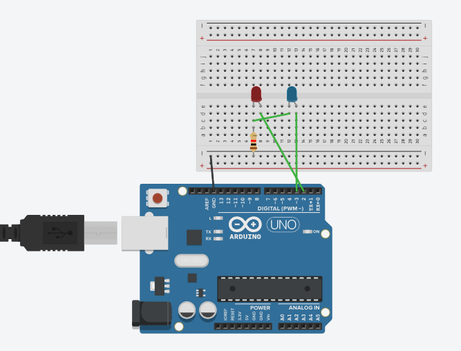

# Reto 1: Encendido alternativo de dos diodos led.
El reto trata de conseguir encender un diodo Led mientras que el otro esta apagado así sucesivamente.
El programa se hace con un Arduino conectando los cables a una Placa de pruebas.

[Pincha aquí para ver la prueba en tinkercad](https://www.tinkercad.com/things/7CJUpBiHZaA-arduino/editel?returnTo=https%3A%2F%2Fwww.tinkercad.com%2Fdashboard)

La Prueba con Tinkercad:

El circuito tiene un Arduino conectado a dos LEDs mediante una protoboard. El programa hace que los dos LEDs se enciendan y apaguen alternativamente cada 1 segundo.

El Arduino es el cerebro del circuito y controla los Leds.

La Protoboard sirve para montar y conectar los componentes sin soldar.

Los leds se encienden cuando reciben corriente.

La resistencia limita la corriente para proteger los Leds.

Los cables conectan el Arduino con los diferentes componentes.

El cable USB alimenta el Arduino y permite cargar el programa desde el ordenador.

El Código:

Este programa controla dos LEDs conectados a Arduino.
Primero configura los pines 2 y 3.
Después enciende el LED del pin 2 y apaga el del pin 3.
Espera 1 segundo antes de cambiar.
Luego apaga el pin 2 y enciende el pin 3.
Este proceso se repite continuamente.

OUTPUT significa que el pin controla un componente

HIGH significa encendido

LOW significa apagado

pinMode sirve para decirle a Arduino cómo se va a usar un pin

digitalWrite sirve para poner un pin en HIGH o LOW

delay(1000) hace que Arduino espere 1 segundo antes de continuar

Así quedaría el Reto 1:

Vídeo realizado por (Lorenzo/@LorenRobótica879)
El vídeo lo he sacado de Youtube

